# Building a Laraval Web App That Incorporates Machine Learning
*By Kevin Reinholz*

## Introduction

Machine Learning is all the rage these days. That having been said, there are a lot of misconceptions about just what *Machine Learning* **is**.

When some readers think about "Machine Learning" or "Artificial Intelligence," they think *this*:


In reality, though, "Machine Learning" is more like *this*:


That's right. Machine Learning is basically *Math*. Fancy, high level Math with lots of iterations as a Cost Function is optimized to reduce the error rate and generate a good Model (a.k.a. "hypothesis").

To get the most out of Machine Learning, it would be really helpful to brush up on [Calculus](https://www.extension.harvard.edu/course-catalog/courses/multivariable-calculus/11648), [Statistics](https://www.extension.harvard.edu/course-catalog/courses/mathematical-statistics/25141), and [Linear Algebra](https://www.extension.harvard.edu/course-catalog/courses/linear-algebra/21474). While there are extremely powerful Machine Learning algorithms available for use out-of-the-box in multiple programming languages, having the proper Mathematical background to understand what they are doing and how to optimize a Cost Function, not to mention which algorithm to select in the first place, is incredibly helpful, even if you plan on using a third party library rather than writing your own.

Now before your eyes glaze over and you balk at the prospect of deep diving into *Math*, here are just a few of the amazing things data scientists have already done with Machine Learning:
+ [Spleeter](https://github.com/deezer/spleeter) - separate vocals from accompanying instruments in any song
+ [DeOldify](https://github.com/jantic/DeOldify) - colorize black and white images
+ [Replika](https://replika.ai/) - a chatbot who's always willing to listen and be a sounding board
+ Self-Driving Cars
+ Stock Market Predictors
+ Recommendation systems like those used by Netflix and Amazon
+ Personal digital assistants like Siri, Alexa, and Google Assistant

Your imagination is pretty much the limit for what can be accomplished using Machine Learning.

Although there are __amazing__ Machine Learning libraries out there--[scikit-learn](https://scikit-learn.org/stable/) and [TensorFlow](https://www.tensorflow.org/) come to mind--it really is helpful to learn the basics of Machine Learning from the ground up so you can conceptualize what is going on underneath the hood of these powerful technologies. To that end, I highly recommend [Dr. Andrew Ng of Stanford University's introductory Machine Learning course](https://www.coursera.org/learn/machine-learning). It's challenging if you don't have a strong Math background, but it does offer a brief Linear Algebra review. (You'll still get more out of it if you remember how to find a derivative, i.e. from Calculus).

Why bother learning how to write Machine Learning algorithms when infinitely more refined algorithms written by other data scientists are readily available via downloadable libraries?


In seriousness, even though you might not plan on writing a competing algorithm, you'll have a much better understanding of how popular Machine Learning algorithms work and which to use on a given problem if you invest the time to practice writing your own.

A lot of Machine Learning, especially on the web, is done using **Python**. One might therefore ask, "why bother with Machine Learning in **PHP**?" That's a legitimate question. With so much work in Machine Learning done in **Python**, and the [ease of deploying your Machine Learning model to the web using the lightweight Flask framework](https://towardsdatascience.com/how-to-easily-deploy-machine-learning-models-using-flask-b95af8fe34d4), it may seem counterintuitive to bother with Machine Learning in **PHP**. After all, setting up a [Flask](https://flask.palletsprojects.com/) web app with API routes is trivial. We could easily deploy a Python-based Machine Learning model to the web this way, and provide API routes to be consumed by a [Laravel](https://laravel.com/), [Express](https://expressjs.com/), or [Ruby-on-Rails](https://rubyonrails.org/) web server, or for that matter by a pure-frontend SPA powered by [Vue](https://vuejs.org/), [Angular](https://angular.io/), [React](https://reactjs.org/), or [Ember](https://emberjs.com/), or by an [iOS](https://www.apple.com/ios/ios-13/) or [Android](https://www.android.com/) mobile app.

It really depends on the scale of your Machine Learning model and web app, but there are use cases for training, testing, and deploying a Machine Learning model in **PHP**, and serving it up from a **Laravel** web application server. For example, a small app could be housed on a single server or [DigitalOcean Droplet](https://www.digitalocean.com/products/droplets/), saving you hosting costs while allowing you to demonstrate your brilliant Machine Learning app to the world. Besides, this is a course on **PHP** and **Laravel**, so why not?

Arkadiusz Kondas has written a very useful [PHP-ML](https://github.com/php-ai/php-ml) library and made it available to **PHP** and **Laravel** developers like us. In the following guide, we're going to create a new **Laravel** project, import the **PHP-ML** library, then train and test a Machine Learning model using command line PHP, and finally save our refined model and incorporate it into a Laravel Controller so users of our app can interact with it. That's right--we're going to deploy a small Laravel app that allows users to interact with a Machine Learning model.

## Getting started -- creating a new Laravel app

Believe it or not, our first step is to create an everyday, ordinary **Laravel** app. We'll use the [CSCI E-15 Course Notes](https://hesweb.dev/e15/notes/laravel/new-laravel-app) as our guide.

First, assuming you have [XAMPP](https://hesweb.dev/e15/notes/local-server/intro) and [Composer](https://hesweb.dev/e15/notes/php/composer) installed, use the command line to enter your Github-linked directory (in the following example I'll be using my __e15__ directory):

```
λ cd C:\xampp\htdocs\e15
λ composer create-project --prefer-dist laravel/laravel classifier "7.*.*"
```
Where "classifier" is the name we're giving to our project. More on that to come. If all goes well, you should see something like this in your terminal:

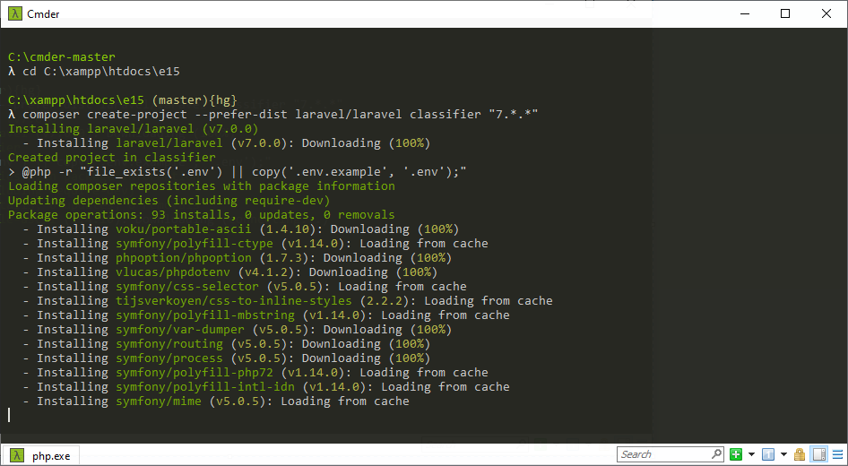

Which can take some time to run. If successful, you should see something like the following:

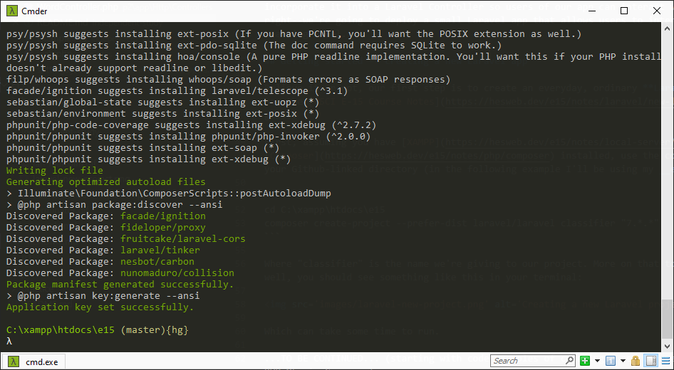

Change directories to our new "classifier" app:

```
λ cd classifier
```
(Note: on a Mac or Linux machine, your command prompts will look a little different, for example starting with a dollar sign instead of a lambda like they do on my Windows 10 machine).

Since we're on a Windows machine, we don't have to worry about permissions (at least on our local server--on production, we absolutely *will*). If you're on a Mac, make sure to follow the directions [here](https://hesweb.dev/e15/notes/laravel/new-laravel-app#permissions) to ensure your Laravel app is able to run.

For convenience during development, we should absolutely follow the course instructions [here](https://hesweb.dev/e15/notes/local-server/local-domains) to set up a local domain, but for a quick and dirty test to see if our new Laravel app is running properly, direct your web browser to:

```
http://localhost/e15/classifier/public/
```
And you should see something like the following:

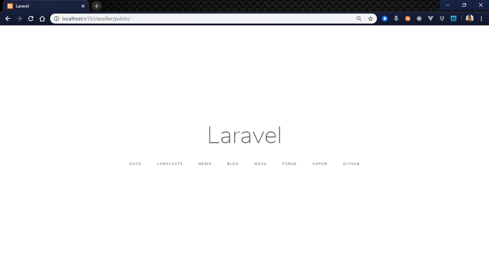

Of course, we'll want to edit the following files to make this app easier to work with from our local XAMPP server:

```
C:\xampp\apache\conf\extra\httpd-vhosts.conf
C:\Windows\System32\drivers\etc\hosts
```
Following the course instructions [here](https://hesweb.dev/e15/notes/local-server/local-domains#step-2-virtualhost-entry) and [here](https://hesweb.dev/e15/notes/local-server/local-domains#step-3-create-a-new-host) to add a new VirtualHost entry (I chose `classifer.loc`) and to create a new local host. Now we can access our **Laravel** app by going to the following address in our web browser:

```
http://classifier.loc
```

That'll make further development easier/more convenient. 

Now to bring in the [PHP-ML](https://github.com/php-ai/php-ml) library:

```
λ composer require php-ai/php-ml
```
It's really that easy. If successful, you should see something like the following:

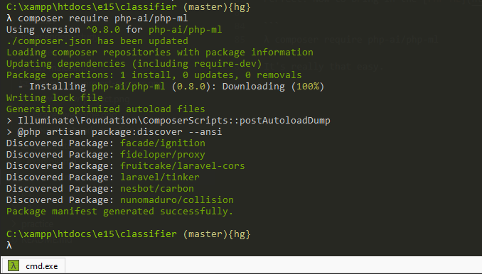

Success! We're going to set aside our Laravel app for the moment, and focus on the Machine Learning portion of this project--specifically, creating, training, and testing our model before packaging it up so we can serve it up to users via a [Laravel Controller](https://laravel.com/docs/master/controllers).

## Creating our Machine Learning model

At this point, our imagination (and coding/data science skills) is really the limit, but to keep this tutorial simple, I'm going to utilize one of Arkadiusz Kondas' examples so we can get back to **Laravel** integration as quickly as possible.

I found the [text classification](https://arkadiuszkondas.com/text-data-classification-with-bbc-news-article-dataset/) example Machine Learning model to be interesting enough, and to lend itself easily enough to integration with a **Laravel** app that accepts user input, to make it perfect for this example.

Before proceeding, let me explain my rationale for using one of the [PHP-ML-Examples](https://github.com/php-ai/php-ml-examples) created by Arkadiusz Kondas instead of creating my own from scratch:

1. Finding a good dataset to work with is *everything*. The bundled examples have the advantage of including ready-to-use datasets.
2. While a number of excellent datasets can be found on sites such as [Kaggle](https://www.kaggle.com/datasets), they are either difficult to download or designed for use within a cloud-based Python environment, e.g. the following:

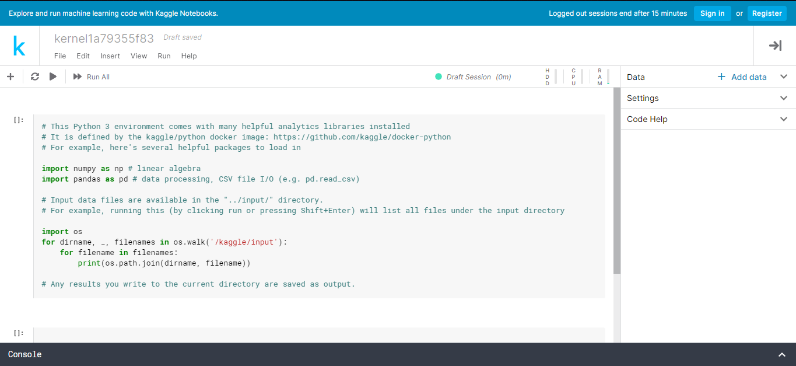

3. Finding and preparing a dataset can be a time-consuming task, and for purposes of demonstrating a **Laravel** app incorporating a Machine Learning model, using one of the [PHP-ML-Examples](https://github.com/php-ai/php-ml-examples) will save us a tremendous amount of time.

All right, so it's time to get our hands dirty with the PHP-ML library. First, we need our training/test data, so navigate to the following site in your web browser:

```
http://mlg.ucd.ie/datasets/bbc.html
```
And download the [raw text files](http://mlg.ucd.ie/files/datasets/bbc-fulltext.zip).

Extract the downloaded .zip archive someplace logical. I chose:

```
C:\xampp\htdocs\e15\classifier\database
```
Now that we have our dataset, it's time to write some PHP. Here's where we reach another dilemma: do we want to do the training and testing of our Machine Learning model within a Laravel Controller, which will lead to a very slow and unpleasant browsing experience for users of our web app, or is there a smoother way to do this?

Fortunately, there is. The PHP-ML library allows us to write command line PHP to train and test our model, then save the trained model to a file that we can import into a Laravel Controller...the already trained model will take about 1 second to run, vice a much longer run time, almost a minute as you'll see later on.

Since we installed the PHP-ML library within our Laravel app, let's create our command line PHP Machine Learning model training and testing code within our Laravel directory. I think a reasonable file location to house this file that we're going to run from the command line and not make publicly accessible would be within a newly created directory:

```
C:\xampp\htdocs\e15\classifier\resources\ml
```
So that's where we're going to create it.

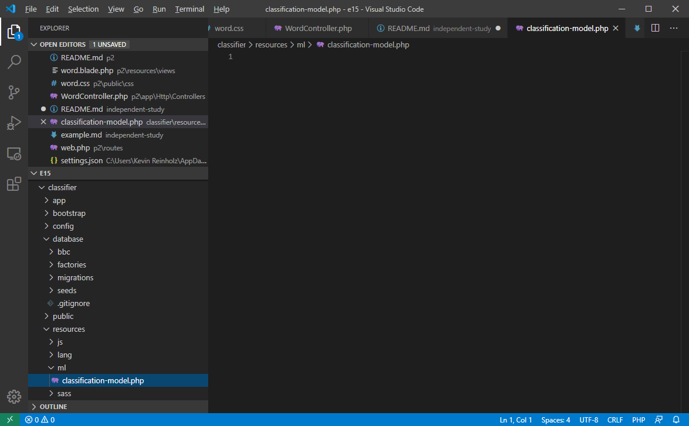

Now to write our Machine Learning code. (Or in our case, copy the example found [here](https://github.com/php-ai/php-ml-examples/blob/master/classification/bbc.php) and [here](https://github.com/php-ai/php-ml-examples/blob/master/classification/bbcPipeline.php) and modify it for our purposes).

## Training and Testing our Machine Learning Model from the command line

First, this is what my `classification-model.php` file looks like:

```php
<?php

declare(strict_types=1);

use Phpml\Classification\SVC;
use Phpml\CrossValidation\StratifiedRandomSplit;
use Phpml\Dataset\FilesDataset;
use Phpml\FeatureExtraction\StopWords\English;
use Phpml\FeatureExtraction\TfIdfTransformer;
use Phpml\FeatureExtraction\TokenCountVectorizer;
use Phpml\Metric\Accuracy;
use Phpml\ModelManager;
use Phpml\Pipeline;
use Phpml\SupportVectorMachine\Kernel;
use Phpml\Tokenization\NGramTokenizer;

include '../../vendor/autoload.php';

$dataset = new FilesDataset('../../database/bbc');
$split = new StratifiedRandomSplit($dataset, 0.3);

$pipeline = new Pipeline([
    new TokenCountVectorizer($tokenizer = new NGramTokenizer(1, 3), new English()),
    new TfIdfTransformer()
], new SVC(Kernel::LINEAR));

$start = microtime(true);
$pipeline->train($split->getTrainSamples(), $split->getTrainLabels());
$stop = microtime(true);
$predicted = $pipeline->predict($split->getTestSamples());

echo 'Train: ' . round($stop - $start, 4) . 's'. PHP_EOL;
echo 'Estimator: ' . get_class($pipeline->getEstimator()) . PHP_EOL;
echo 'Tokenizer: ' . get_class($tokenizer) . PHP_EOL;
echo 'Accuracy: ' . Accuracy::score($split->getTestLabels(), $predicted);

$modelManager = new ModelManager();
$modelManager->saveToFile($pipeline, 'bbc-nb.phpml');
```
And now to set it loose on that BBC data we downloaded earlier.

```
λ php -d memory_limit=-1 classification-model.php
```
Note that I'm running the script from the command line, and that I've removed PHP's built-in memory limit (normally not a good idea, but this is Machine Learning, and it's very memory intensive). Where did I learn this trick? [StackOverflow](https://stackoverflow.com/a/36000650), of course. At any rate, we're not doing something so dangerous on a production server, and our intent is to save the trained model to a file, `bbc-nb.phpml` and then run it within a Laravel Controller, so it should be OK.

Running the latest version of XAMPP (7.4.4) on my Windows laptop, the script ran successfully:

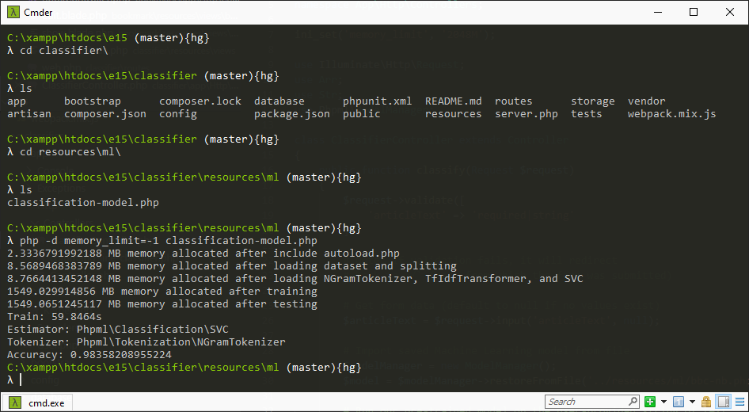

However, a previous attempt to run this same script with XAMPP (7.3.1) installed resulted in failure:

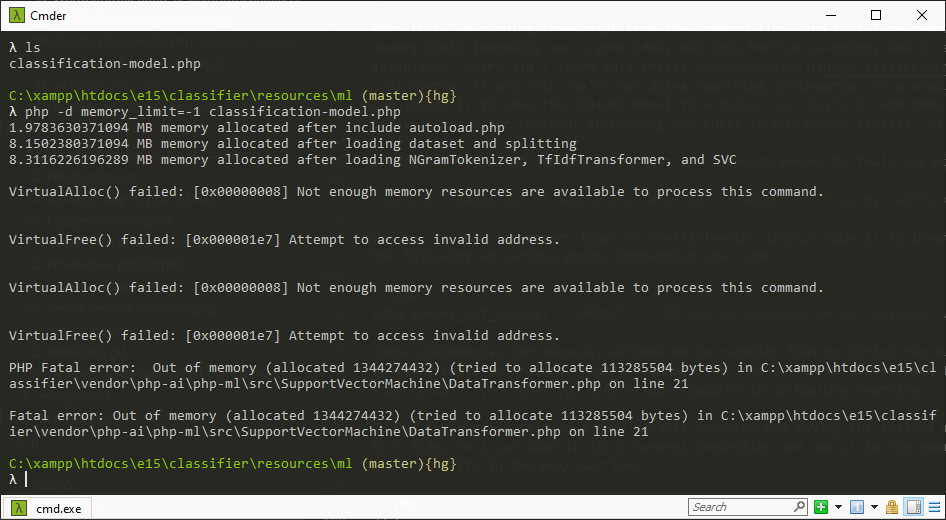

One way to look for memory leaks or inefficiencies in your code is to insert statements like the following at various points throughout your code:

```php
echo memory_get_usage() / 1048576 . ' MB memory allocated after training' . PHP_EOL;
```
These statements can help narrow down the most memory intensive portions of the script and identify possible errors/inefficiencies.

Prior to upgrading my version of XAMPP, as an experiment I pushed my classifier project to Github, then cloned it onto another machine. Running `classification-model.php` again yielded different and much more satisfying results:

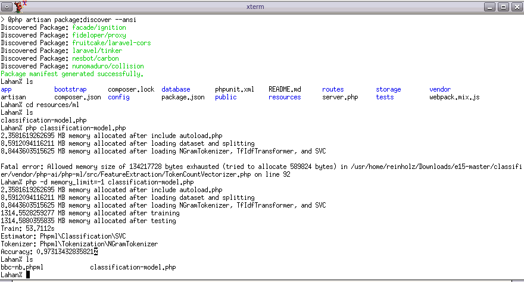

Note that it took just under 54 seconds to train and test our model on my FreeBSD machine, but the memory consumption wasn't actually that high (less than 2 GB of RAM)... My Windows laptop was fully capable of running the script, provided the right version of XAMPP was installed and my temporary lifting of memory usage limits was obeyed. The model had 97% accuracy at classifying our test data during the run on my desktop. Contrast that with a run time of slightly over 59 seconds on my laptop and a 98% accuracy rate. Why the disparity in accuracy rate? We *split* our data randomly into training and testing data, so that likely accounts for the slightly different results on different runs. At any rate, neither result is a bad one for a machine learning model. 

Importantly for our **Laravel** web app, our trained model was saved to a file, `bbc-nb.phpml`, that we can load within a Laravel Controller and use to process user input (since it would be pretty poor form for a web app to burn through over 1 GB of server RAM *and* take over 53 seconds to return results to the user!).

But what's inside our computer-generated "black box"?

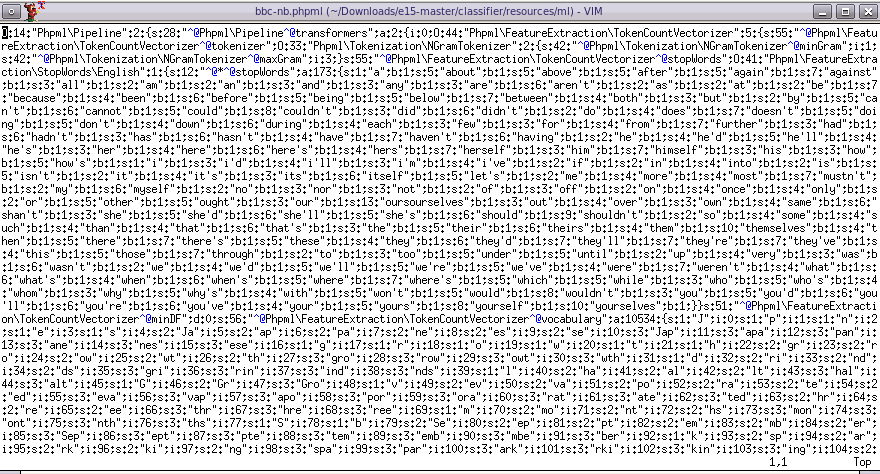

Well...glad that clears things up! The file is approximately 250 MB in size, so it's no lightweight, either. Note that the file, `bbc-nb.phpml`, is saved to the following directory:

```
C:\xampp\htdocs\e15\classifier\resources\ml
```
Now that we've trained our machine learning model, we're ready to return to our **Laravel** app and direct user input to the trained model so we can dazzle visitors to our site with our text classification magic.

## Incorporating our trained Machine Learning model into our Laravel app

Now that we've written and trained our Machine Learning text classification model, and saved it to a file so we can leverage its power *without* the need to re-train it, it's time to incorporate the model into our **Laravel** app.

I'm not going to rehash the entire process of setting up a **Laravel** app, so you should instead refer to [Week 5](https://hesweb.dev/e15/week/5), [Week 6](https://hesweb.dev/e15/week/6), and [Week 7](https://hesweb.dev/e15/week/7) of the CSCI E-15 notes and lectures.

For purposes of getting this app ready to demonstrate, I made the following edits to the following files:

```
C:\xampp\htdocs\e15\classifier\routes\web.php
```
```php
<?php

/*
|--------------------------------------------------------------------------
| Web Routes
|--------------------------------------------------------------------------
|
| Here is where you can register web routes for your application. These
| routes are loaded by the RouteServiceProvider within a group which
| contains the "web" middleware group. Now create something great!
|
*/

Route::get('/', 'ClassifierController@index');
Route::post('/classify', 'ClassifierController@classify');
```
```
C:\xampp\htdocs\e15\classifier\app\Http\Controllers\ClassifierController.php
```
```php
<?php

declare(strict_types=1);

namespace App\Http\Controllers;

use Illuminate\Http\Request;
use Arr;
use Str;
use Phpml\ModelManager;

class ClassifierController extends Controller
{
    public function classify(Request $request)
    {
        $request->validate([
            'articleText' => 'required|string'
        ]);

        # Note: if validation fails, it will redirect
        # back to `/` (page from which the form was submitted)

        # Get form data (default to null if no values exist)
        $articleText = $request->input('articleText', null);

        # Import saved Machine Learning model from file
        $modelManager = new ModelManager();
        $model = $modelManager->restoreFromFile('../resources/ml/bbc-nb.phpml');

        # Run our pre-trained model on the user-provided string of text
        $predicted = $model->predict([$articleText])[0];

        # Redirect back to the form with data/results stored in the session
        # Ref: https://laravel.com/docs/redirects#redirecting-with-flashed-session-data
        return redirect('/')->with([
            'articleText' => $articleText,
            'predicted' => $predicted
        ]);
    }

    # Initial page view--if session data exists, pre-fill form accordingly
    public function index()
    {
        return view('classifier')->with([
            'articleText' => session('articleText', null),
            'predicted' => session('predicted', null)
        ]);
    }
}
```
```
C:\xampp\htdocs\e15\classifier\resources\views\classifer.blade.php
```
```php
<!DOCTYPE html>
<html lang="{{ str_replace('_', '-', app()->getLocale()) }}">
    <head>
        <meta charset="utf-8">
        <meta name="viewport" content="width=device-width, initial-scale=1">
        <link href='/css/classifier.css' rel='stylesheet'>
        <title>New Article Classifier</title>
    </head>
    <body>
        <div class='content'>
        <header>
            <div class="title m-b-md">
                News Article Classifier Using Machine Learning
            </div>
        </header>

        <p>
            Copy and paste the text of a news article to have AI classify it into a category.
        </p>
        
        <form method='POST' action='/classify'>

            {{ csrf_field() }}

            <label for='inputString'>Article text:</label>
            <textarea name='articleText'>{{ old('articleText', $articleText) }}</textarea>
            <p></p>    
            @if($errors->get('articleText'))
                <div class='error'>This field must be filled out with plain text (no images) from a news article.</div>
                <p></p>
            @endif
            <button type='submit'>Classify this article</button>
        </form>
        <p></p>
        @if($predicted)
        <h2>Machine Learning Classification Results</h2>
        <p>The computer classified your article as {{ $predicted }}</p>
        <p></p>
        @endif

        <footer>
            Based on <a href='https://arkadiuszkondas.com/text-data-classification-with-bbc-news-article-dataset/'>Text data classification with BBC news article dataset</a> by Arkadiusz Kondas
        </footer>
    </div>
    </body>
</html>
```
```
C:\xampp\htdocs\e15\classifier\public\css\classifier.css
```
```css
html, body {
    background-color: #fff;
    color: #636b6f;
    font-family: 'Nunito', sans-serif;
    font-weight: 200;
    height: 100vh;
    margin: 0;
}

.full-height {
    height: 100vh;
}

.flex-center {
    align-items: center;
    display: flex;
    justify-content: center;
}

.position-ref {
    position: relative;
}

.top-right {
    position: absolute;
    right: 10px;
    top: 18px;
}

.content {
    text-align: center;
}

.title {
    font-size: 84px;
}

.links > a {
    color: #636b6f;
    padding: 0 25px;
    font-size: 13px;
    font-weight: 600;
    letter-spacing: .1rem;
    text-decoration: none;
    text-transform: uppercase;
}

.m-b-md {
    margin-bottom: 30px;
}

/* The following error class comes from Bootstrap
   Ref: https://github.com/twbs/bootstrap/blob/master/dist/css/bootstrap.css */
.error {
    color: #721c24;
    background-color: #f8d7da;
    border-color: #f5c6cb;
}
```
Now to test our app by browsing to `http://classifier.loc`. Based on the above code, our app should look something like this when run locally in a web browser:

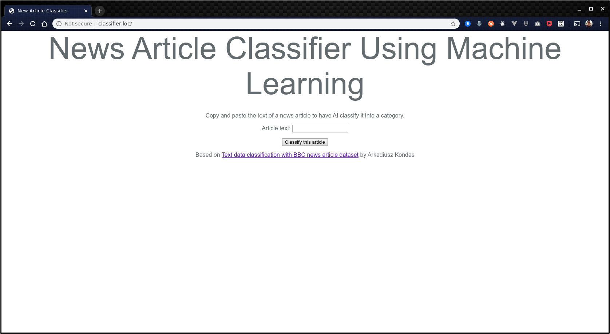

To test it, simply copy a section of text from a news article, paste it into the text input, and click the `Classify this article` button.

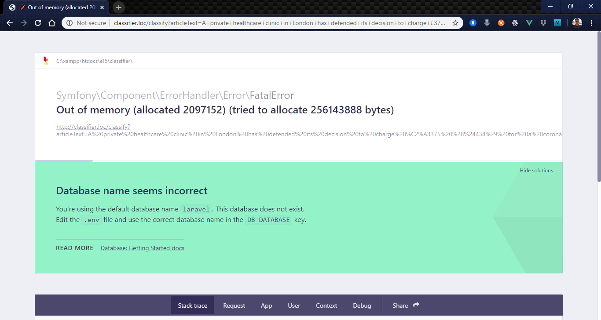

That didn't go as we expected. Time to modify our `ClassifierController.php` using the advice found [here](https://haydenjames.io/understanding-php-memory_limit/):

```php
<?php

declare(strict_types=1);

namespace App\Http\Controllers;

ini_set('memory_limit', '2048M');
```
After which our app should have plenty of memory to complete the text processing.

Here is the first successful result page I got after copying and pasting in the text of a BBC News article:

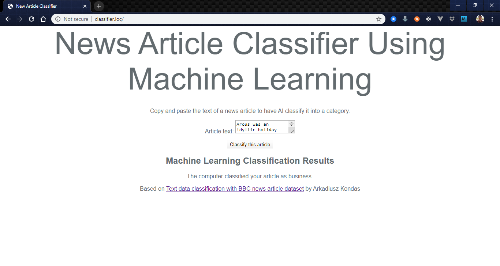

And some older runs from my desktop machine, a FreeBSD system running an apache24 web server I set up for testing purposes as an alternative to XAMPP on Windows, beginning with this article:

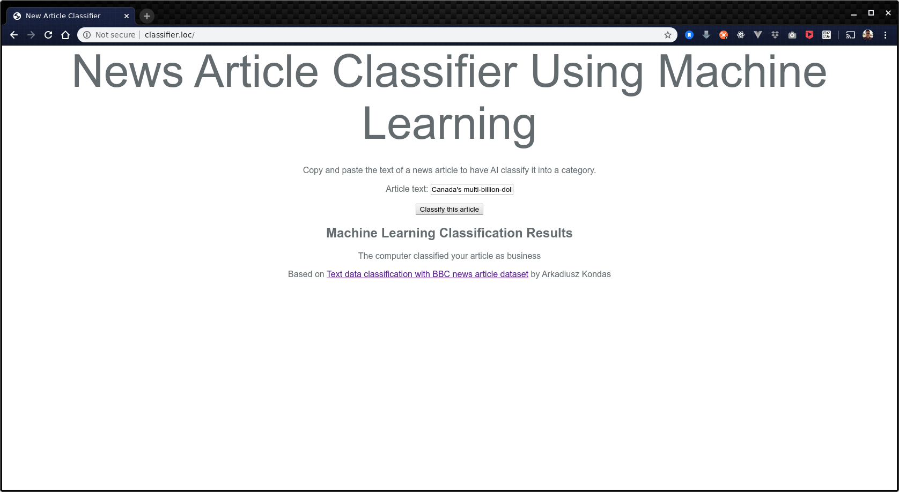

Results when running the model on a third article:


We don't just have to run it on Google's Chrome web browser. This is what a results page looks like in Firefox:

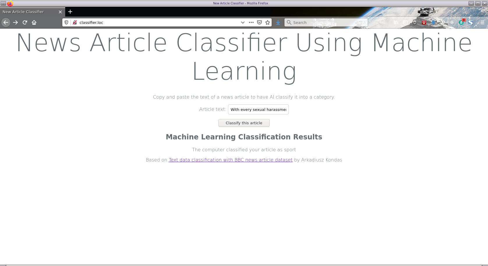

Note that we set our app up to submit queries via POST. The following illustrates why--submitting our query via GET can yield an error if the article text is too long:


## Deploying to Production

Honestly, my experiences with local testing led me to conclude that this is not an app I would want to deploy to production--the memory usage requirements are simply too high, at least for my lowest tier DigitalOcean droplet. If you have a better server, feel free to try!

If you did decide to push this app (or a similar one) to production, please note that our trained Machine Learning model is too large of a file to be uploaded to Github:

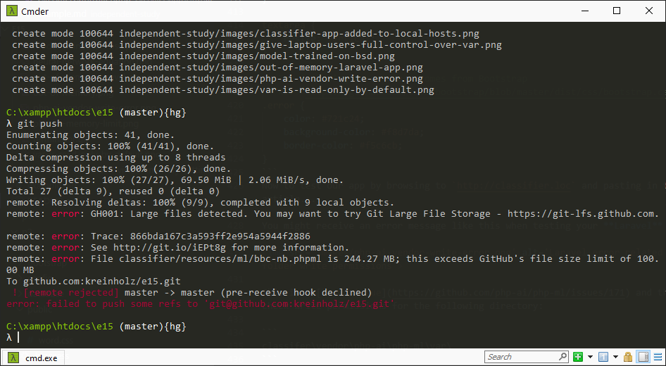

So you'll want to be sure to add `resources/ml/` to your `.gitignore` file. 

Moreover, `bbc-nb.phpml` hard codes the directory it was run from, so unless your directory tree is identical on your development and production servers (unlikely), it's better to run the command line `classification-model.php` script on your production server to generate this file, rather than attempting to copy `bbc-nb.phpml` to the production server via `scp` or a similar utility.

## Final Thoughts

The **PHP-AI/PHP-ML** is an impressive library and proof-of-concept for performing Machine Learning in PHP, and relatively easy to integrate with **Laravel** web apps. However, we should be cognizant of the memory requirements to run Machine Learning algorithms such as Support Vector Machines (which is what we used in the classification example), which may be more than we want running on a small web server.

All of the official examples provided with the library are for command line PHP scripts. As an experiment, I created a command line PHP script in the same directory as our `ClassifierController`. If you want to try the same, create the following file:

```
C:\xampp\htdocs\e15\classifier\app\Http\Controllers\command-line-classier.php
```
```php
<?php

declare(strict_types=1);

namespace App\Http\Controllers;

ini_set('memory_limit', '2048M');

use Illuminate\Http\Request;
use Arr;
use Str;

use Phpml\ModelManager;

include '../../../vendor/autoload.php';

$articleText = "Canada's multi-billion-dollar relief package to respond to the coronavirus slowdown has passed in the Senate.  It allows the government to spend C$82bn ($57bn, £48bn) in emergency aid and economic stimulus.  The bill received approval on Wednesday with support from all parties, after amendments that removed provisions giving cabinet unprecedented powers.  The bill is scheduled to get Royal Assent later on Wednesday.  Legislators passed the package, worth about 3% of the country's GDP, after a debate in the House of Commons that went into the early morning hours.  Prime Minister Justin Trudeau had promised to push the bill through parliament this week.      Canadian PM Trudeau's wife tests positive for coronavirus  Local governments have been increasing social-distancing measures to stem the spread of coronavirus, which has led thousands of businesses to close their doors.  The federal government has received nearly one million claims for unemployment benefits last week, which is equivalent to about 5%";

        # Import saved Machine Learning model from file
        $modelManager = new ModelManager();
        $model = $modelManager->restoreFromFile('../../../resources/ml/bbc-nb.phpml');
$start = microtime(true);
        # Run our pre-trained model on the user-provided string of text
        $predicted = $model->predict([$articleText])[0];
$stop = microtime(true);

echo 'Time: ' . round($stop - $start, 4) . 's'. PHP_EOL;
echo $predicted;
```
Note that I hard-coded a string of text that I copied and pasted from a news article so I'd have something to feed to my classifer.

Run it from the command line like this:

```
λ cd C:\xampp\htdocs\e15\classifer\app\Http\Controllers
λ php command-line-classier.php
```
You should see something like the following output:

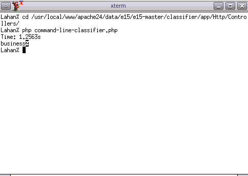

Note that I didn't have to specify a different runtime memory limit, because I already hardcoded the increased memory limit in `command-line-classifier.php`. Two different ways to achieve a similar result.

This was a fun journey incorporating Machine Learning written in native PHP into a **Laravel** web app, and I think Machine Learning is extremely cool! As mentioned earlier, there are some extremely robust Machine Learning libraries written in Python, and some of the memory intensive tasks that might make us shy away from hosting a **Laravel** app with "in-house" Machine Learning capabilities courtsey of the **PHP-AI/PHP-ML** library can alternatively be done in the cloud courtesy of [Jupyter Notebooks](https://jupyter.org/), [TensorFlow](https://www.tensorflow.org/), and similar technologies. If you want to deploy a **Laravel** web app that incorporates Machine Learning, it is not necessary to use the **PHP-AI/PHP-ML** library--you can access TensorFlow's APIs from your app, or access APIs served by a simple **Flask** app written in Python.

If this has piqued your interest in Machine Learning, [Kaggle](https://www.kaggle.com/) is a great place to get your hands dirty building Machine Learning applications (in the cloud, without my laptop's RAM limitations). Kaggle offers cash prices for a number of Machine Learning challenges/competitions, so not only is it good practice, it can also be a money-maker!

## Common Issues

You might receive an error message like this when testing your **Laravel** app locally:

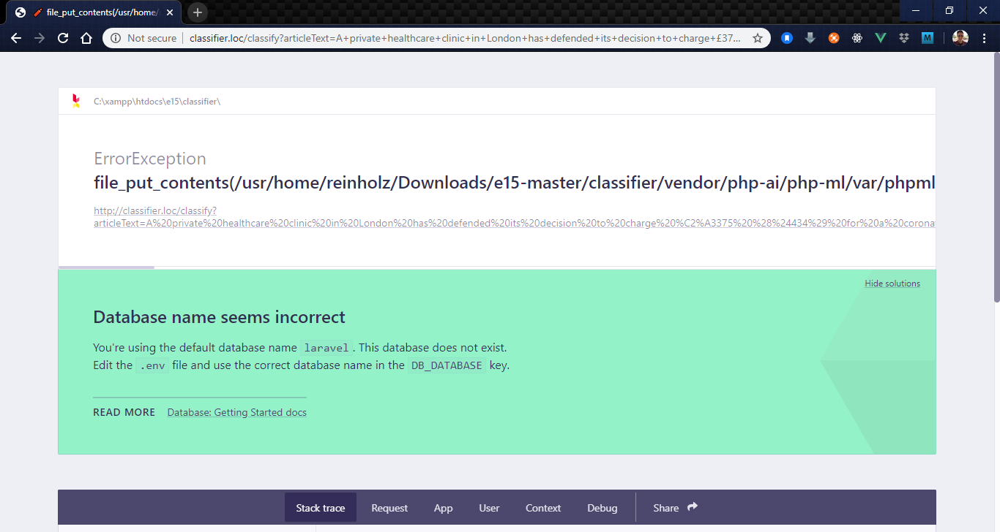

This is a [known issue](https://github.com/php-ai/php-ml/issues/171) and the solution is to check write permissions for the following directory:

```
classifer\vendor\php-ai\php-ml\var\
```
On my Windows 10 laptop, it turned out this folder was marked "read only", all I had to do was uncheck that box and confirm I wanted to remove the "read only" attribute from this folder and all subfolders/files contained therein.

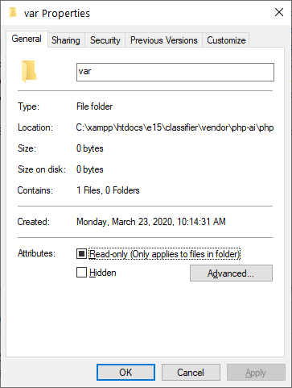

And then make sure computer users have write permissions to this folder as well:

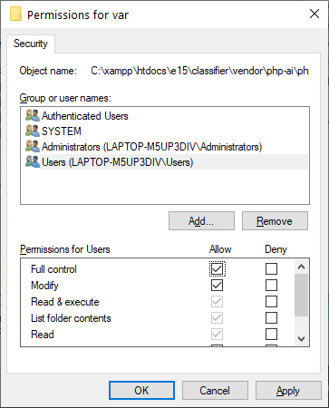

Although odds are you don't have a FreeBSD local development machine, these are the steps I used to transfer my development code from my Windows laptop over:

Install apache24 on FreeBSD and enable it. This involves at a minimum adding the following lines to `/etc/rc.conf`:

```
apache24_enable="YES"
apache24_http_accept_enable="YES"
```
There are some additional configuration tweaks I did on my FreeBSD Apache server, but I highly doubt these details will be interesting to the average reader. If you do have a FreeBSD machine, I'm assuming you know how to get an Apache server up and running on it.

Clone the Github repository containing our development code to the FreeBSD system (it's OK to do a manual download of .zip file rather than doing a `git pull`), copy application `classifier/` to `/usr/local/www/apache24/data/`

Edit `/usr/local/etc/apache24/extra/httpd-vhosts.conf` and make sure there's an entry for the app:

```html
<VirtualHost *:80>
        ServerName classifier.loc
        DocumentRoot /usr/local/www/apache24/data/classifier/public
        <Directory /usr/local/www/apache24/data/classifier/public>
                Options Indexes FollowSymlinks MultiViews
                AllowOverride All
                Order allow,deny
                allow from all
        </Directory>
</VirtualHost>
```
Edit `/etc/hosts` and make sure there's an entry for the app:

```
127.0.0.1 classifer.loc
```
Change write permissions to the following directories (same as Mac users have to do):

```
sudo chmod -R 777 storage 
sudo chmod -R 777 bootstrap/cache
```
From our application directory root of `/usr/local/www/apache24/data/classifier` or whatever your application root is (for example, it might be `data/e15/classifier`), run the following commands:

```
composer install
cp .env.example .env
php artisan key:generate
sudo service apache24 restart
```

The Laravel app should now be accessible from a web browser by going to:

`http://classifier.loc`

While at this point we can run the `command-line-classifier.php` script, two more permissions-related changes have to be made before the **Laravel** web app will function properly:

```
sudo chown -R www /usr/local/www/apache24/data/classifier/storage
sudo chown -R www /usr/local/www/apache24/data/classifier/vendor
```
Where `www` is the name of the Apache user on FreeBSD. Without changing the ownership of these directories, a permissions error similar to the Windows error displayed at the beginning of this section will crop up on FreeBSD.

## Sources
+ [Dr. Andrew Ng's course on Machine Learning](https://www.coursera.org/learn/machine-learning)
+ [TowardsDataScience article on deploying a Machine Learning app using Flask/Python](https://towardsdatascience.com/how-to-easily-deploy-machine-learning-models-using-flask-b95af8fe34d4)
+ [PHP-AI/PHP-ML Documentation](https://php-ml.readthedocs.io/en/latest/)
+ [CSCI E-15 Course Notes](https://hesweb.dev/e15/notes/)
+ [Official Laravel Documenation on Controllers](https://laravel.com/docs/master/controllers)
+ [Arkadiusz Kondas' article on the PHP-AI/PHP-ML example BBC News Classifier](https://arkadiuszkondas.com/text-data-classification-with-bbc-news-article-dataset/)
+ [Github code repository for PHP-AI/PHP-ML BBC News Classifier example](https://github.com/php-ai/php-ml-examples/blob/master/classification/bbc.php)
+ [Github code repository for alternate PHP-AI/PHP-ML BBC News Classifier example](https://github.com/php-ai/php-ml-examples/blob/master/classification/bbcPipeline.php)
+ [StackOverflow answer to PHP memory limit error](https://stackoverflow.com/a/36000650)
+ [PHP Manual documentation on memory_get_usage](https://www.php.net/manual/en/function.memory-get-usage.php)
+ [PHP Manual documentation on reserved constant PHP_EOL](https://www.php.net/manual/en/reserved.constants.php)
+ [Blog Post on alternative way to increase PHP memory limit for a single file](https://haydenjames.io/understanding-php-memory_limit/)
+ [Github Issues Forum for PHP-AI/PHP-ML project](https://github.com/php-ai/php-ml/issues/171)