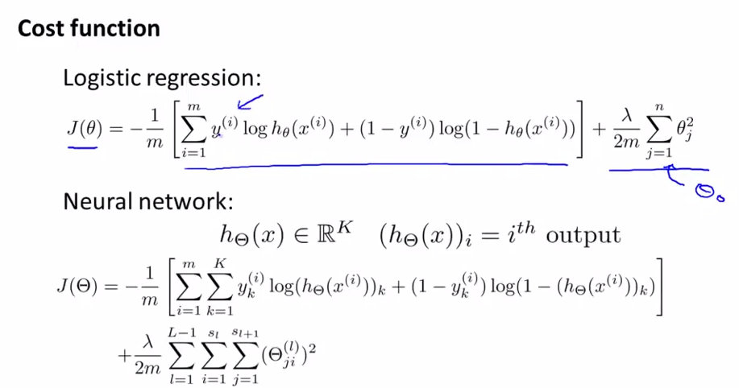

# Building a Laraval Web App That Incorporates Machine Learning
*By Kevin Reinholz*

Machine Learning is all the rage these days. That having been said, there are a lot of misconceptions about just what *Machine Learning* **is**.

When some readers think about "Machine Learning" or "Artificial Intelligence," they think *this*:

In reality, though, "Machine Learning" is more like *this*:

That's right. Machine Learning is basically *Math*. Fancy, high level Math with lots of iterations as a Cost Function is optimized to reduce the error rate and generate a good Model (a.k.a. "hypothesis").

To get the most out of Machine Learning, it would be really helpful to brush up on [Calculus](https://www.extension.harvard.edu/course-catalog/courses/multivariable-calculus/11648), [Statistics](https://www.extension.harvard.edu/course-catalog/courses/mathematical-statistics/25141), and [Linear Algebra](https://www.extension.harvard.edu/course-catalog/courses/linear-algebra/21474). While there are extremely powerful Machine Learning algorithms available for use out-of-the-box in multiple programming languages, having the proper Mathematical background to understand what they are doing and how to optimize a Cost Function, not to mention which algorithm to select in the first place, is incredibly helpful, even if you plan on using a third party library rather than writing your own.

Now before your eyes glaze over and you balk at the prospect of deep diving into *Math*, here are just a few of the amazing things data scientists have already done with Machine Learning:
+ [Spleeter](https://github.com/deezer/spleeter) - separate vocals from accompanying instruments in any song
+ [DeOldify](https://github.com/jantic/DeOldify) - colorize black and white images
+ [Replika](https://replika.ai/) - a chatbot who's always willing to listen and be a sounding board
+ Self-Driving Cars
+ Stock Market Predictors
+ Recommendation systems like those used by Netflix and Amazon
+ Personal digital assistants like Siri, Alexa, and Google Assistant

Your imagination is pretty much the limit for what can be accomplished using Machine Learning.

Although there are __amazing__ Machine Learning libraries out there--[scikit-learn](https://scikit-learn.org/stable/) and [TensorFlow](https://www.tensorflow.org/) come to mind--it really is helpful to learn the basics of Machine Learning from the ground up so you can conceptualize what is going on underneath the hood of these powerful technologies. To that end, I highly recommend [Dr. Andrew Ng of Stanford University's introductory Machine Learning course](https://www.coursera.org/learn/machine-learning). It's challenging if you don't have a strong Math background, but it does offer a brief Linear Algebra review. (You'll still get more out of it if you remember how to find a derivative, i.e. from Calculus).

Why bother learning how to write Machine Learning algorithms when infinitely more refined algorithms written by other data scientists are readily available?

In seriousness, even though you might not plan on writing a competing algorithm, you'll have a much better understanding of how popular Machine Learning algorithms work and which to use on a given problem if you invest the time to practice writing your own.

A lot of Machine Learning, especially on the web, is done using **Python**. One might therefore ask, "why bother with Machine Learning in **PHP**?" That's a legitimate question. With so much work in Machine Learning done in **Python**, and the [ease of deploying your Machine Learning model to the web using the lightweight Flask framework](https://towardsdatascience.com/how-to-easily-deploy-machine-learning-models-using-flask-b95af8fe34d4), it may seem counterintuitive to bother with Machine Learning in **PHP**. After all, setting up a [Flask](https://flask.palletsprojects.com/) web app with API routes is trivial. We could easily deploy a Python-based Machine Learning model to the web this way, and provide API routes to be consumed by a [Laravel](https://laravel.com/), [Express](https://expressjs.com/), or [Ruby-on-Rails](https://rubyonrails.org/) web server, or for that matter by a pure-frontend SPA powered by [Vue](https://vuejs.org/), [Angular](https://angular.io/), [React](https://reactjs.org/), or [Ember](https://emberjs.com/), or by an [iOS](https://www.apple.com/ios/ios-13/) or [Android](https://www.android.com/) mobile app.

It really depends on the scale of your Machine Learning model and web app, but there are use cases for training, testing, and deploying a Machine Learning model in **PHP**, and serving it up from a **Laravel** web application server. For example, a small app could be housed on a single server or [DigitalOcean Droplet](https://www.digitalocean.com/products/droplets/), saving you hosting costs while allowing you to demonstrate your brilliant Machine Learning app to the world. Besides, this is a course on **PHP** and **Laravel**, so why not?

Arkadiusz Kondas has written a very useful [PHP-ML](https://github.com/php-ai/php-ml) library and made it available to **PHP** and **Laravel** developers like us. In the following guide, we're going to create a new **Laravel** project, import the **PHP-ML** library, then train and test a Machine Learning model using command line PHP, and finally save our refined model and incorporate it into a Laravel Controller so users of our app can interact with it. That's right--we're going to deploy a small Laravel app that allows users to interact with a Machine Learning model.

...TO BE CONTINUED... (starting with code examples of creating a new Laravel app and importing PHP-ML via Composer)